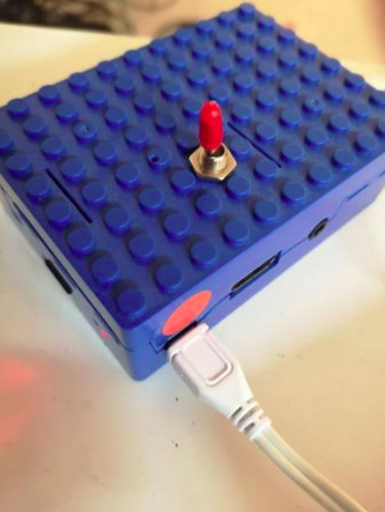

# notes for 'Skandinavisk SuperCollider Klubb Møte' 14th October 2019 (rpi workshop)

## set up SuperCollider on a rpi2, rpi3 or rpi4

and run it either as headless or with the full scide (but for now without help documents).

first we need to put the operating system for the rasberry pi onto a micro sd card

* get raspbian [here](https://www.raspberrypi.org/downloads/raspbian/)
* get and install [balena etcher](https://www.balena.io/etcher/)
* flash raspbian to SD card using etcher
    - unzip raspbian
    - open etcher
    - choose the raspbian image
    - choose the sd card (should be mounted with a card reader)
    - press flash. wait. and check that it was veryfied.

then we proceed to the setup _scroll down for *setup via ssh* (headless)_

## set up SuperCollider via a desktop environment (with hdmi screen, keyboard and mouse)

* connect screen, keyboard and mouse. And open the terminal and type...
* `sudo raspi-config`
    - change hostname (this will be the name of your rpi instead of `rapberrypi`)
    - change User Password
    - go to *Interfacing Options* and enable VNC (if needed)
    - finish and reboot
* then continue with these commands...
* `sudo apt-get update`
* `sudo apt-get upgrade` #optional - takes a while, but if not now then it is a good idea to do this later when you have time
* `sudo apt-get dist-upgrade` #optional - same as above

* _install SuperCollider Standalone_
instructions copied from redFrik's [repo](https://github.com/redFrik/supercolliderStandaloneRPI2#installation))
* `sudo apt-get install qjackctl libqt5quick5 libqt5opengl5`
* `git clone https://github.com/redFrik/supercolliderStandaloneRPI2 --depth 1`
* `mkdir -p ~/.config/SuperCollider`
* `cp supercolliderStandaloneRPI2/sc_ide_conf_temp.yaml ~/.config/SuperCollider/sc_ide_conf.yaml`

NOTE: the last command will create a global sc_ide preference file from a template. At the moment SuperCollider IDE can not use a local configuration file, but hopefully this will change in the future. Also note that if you cloned or moved this repository somewhere else than in your home directory you should edit the yaml file with `nano ~/.config/SuperCollider/sc_ide_conf.yaml` to make the paths in there point to your standalone directory.

KNOWN ISSUES:

* 'libEGL warning: DRI2: failed to authenticate' that is posted in terminal at scide startup is harmless
* 'Open startup file' and 'Open user support directory' menu selections do not open the right file/folder.

## set up SuperCollider via ssh aka headless

1. first we need to enable ssh so we can access the rpi remotely.
    - from your laptop/pc place an empty file called 'ssh' in the root of the raspbian sd card. it is called 'boot' 
2. connect ethernet on the rpi to the same network as your laptop/pc
3. plug in power
4. find the ip address of your rpi on the local network
    1. __macOS__ download and install [lanscan](https://www.iwaxx.com/lanscan/) 
    2. __windows__ download and install [advanced ip scanner](http://www.advanced-ip-scanner.com/)
    3. __linux__ or if you want to do terminal kung fu network stuff on mac and windows (some commands (`awk`) not available on windows)
        - if you dont have nmap use: `sudo apt-get install nmap`
        -`sudo nmap -sP 1.2.3.0/24 | awk '/^Nmap/{ip=$NF}/DC:A6:32/{print ip}'` (use this for raspberry pi 4)
        -`sudo nmap -sP 1.2.3.0/24 | awk '/^Nmap/{ip=$NF}/B8:27:EB/{print ip}'` (use this for raspberry pi 2 and 3)
        if you want to know more about this scroll down to the __# general notes__ section (with instructions to install 'Nmap' on Mac and Windows)
        - you can also use `sudo arp-scan` (linux) and `sudo arp` (macOS)
    
5. then log in via ssh...
    1. `ssh pi@192.169.0.22` - use the ip of your rpi which you discovered on the network in the step above
    2. if it is the first time you connect via ssh on your laptop/pc to this rpi type `yes` to the question about 256SHA fingerprint and hit enter
    3. input the password of your rpi and hit enter
6. success! you should now see a terminal line with `pi@raspberrypi`
7. then proceed and do a `sudo raspi-config`
    1. change hostname (this will be the name of your rpi instead of `rapberrypi`)
    2. change User Password
    3. go to *Interfacing Options* and enable VNC (if needed)
    4. finish and reboot
8. log in again via ssh
    - this time you should see that it will result in `pi@theNewNameOfYourRaspberryPi`
then continue with these commands...
1. `sudo apt-get update`
2. `sudo apt-get upgrade` #optional - takes a while, but if not now then it is a good idea to do this later when you have time
3. `sudo apt-get dist-upgrade` #optional - same as above

* _install SuperCollider Standalone_
instructions copied from Fredriks' [repo](https://github.com/redFrik/supercolliderStandaloneRPI2#installation))
* `sudo apt-get install qjackctl libqt5quick5 libqt5opengl5`
* `git clone https://github.com/redFrik/supercolliderStandaloneRPI2 --depth 1`
* `mkdir -p ~/.config/SuperCollider`
* `cp supercolliderStandaloneRPI2/sc_ide_conf_temp.yaml ~/.config/SuperCollider/sc_ide_conf.yaml`

NOTE: the last command will create a global sc_ide preference file from a template. At the moment SuperCollider IDE can not use a local configuration file, but hopefully this will change in the future. Also note that if you cloned or moved this repository somewhere else than in your home directory you should edit the yaml file with `nano ~/.config/SuperCollider/sc_ide_conf.yaml` to make the paths in there point to your standalone directory.


## Running SuperCollider

#### startup via Desktop environment
--

To run the full IDE first open a terminal window and type...

* `qjackctl`

Select the correct soundcard (under setup/interfaces) and then start jackd. _(if usb soundcard is used also set periods to 3)_

Then open another terminal window and type...

* `cd supercolliderStandaloneRPI2`
* `export PATH=.:$PATH`
* `scide`

or simply just double click the desktop icon. SuperCollider IDE should start and run like normal - with scope, meter, plot, gui, animation, quarks etc.

The startupfile is located in the subdirectory `share/user/` and extensions you can put in `share/user/Extensions/` (first create that directory if it does not exist).

KNOWN ISSUES:

* 'libEGL warning: DRI2: failed to authenticate' that is posted in terminal at scide startup is harmless
* 'Open startup file' and 'Open user support directory' menu selections do not open the right file/folder.

#### running sc headless
--

To run sclang+scsynth only from ssh...

* `export DISPLAY=:0.0`
* `cd supercolliderStandaloneRPI2`
* `./sclang -a -l ~/supercolliderStandaloneRPI2/sclang.yaml`

NOTE: one can also specify a .scd file to load when starting sclang like this: `./sclang -a -l ~/supercolliderStandaloneRPI2/sclang.yaml mycode.scd`

* to exit sclang from the terminal evaluate this `1.exit`
    - then you should be back at 'pi@TheNameOfYourRPI'


### jack
--

If you start SuperCollider without having Jack already running (like when autostarting or running headless), Jack will automatically launch when you boot the server. The audio settings then used are found in the file...

* `nano ~/.jackdrc`

_(this file is created by qjackctl so if you never ran qjackctl you might need to create this file manually.)_

The recommended jack audio settings are...

* `/usr/bin/jackd -P75 -dalsa -dhw:0 -p1024 -n3 -s -r44100`

and to set up Jack to use an external usb sound card change `-dhw:0` to `-dhw:1` like this...

* `/usr/bin/jackd -P75 -dalsa -dhw:1 -p1024 -n3 -s -r44100`

NOTE: the internal soundcard volume is by default set low (40). type `alsamixer` in terminal and adjust the pcm volume to 85 with the arrow keys, esc key exits.

### autostart
--

* `sudo apt-get install xvfb`
* `crontab -e` #and add the following line to the end
  * `@reboot cd /home/pi/supercolliderStandaloneRPI2 && xvfb-run ./autostart.sh`
* `sudo reboot` #and supercollider should automatically start after a while and play some beating sine tones.

Then edit the autostart script to load whichever file. By default it will load `mycode.scd`.


## simple midi usage

* connect your class compliant midi device
* then try these line out in sc...

```supercollider
MIDIClient.init; // check sources and destinations
MIDIIn.connectAll; // quick'n dirty connect to MIDI controller, we will only be using one
MIDIdef.trace
MIDIdef.trace(false); // to stop tracing
```

then run the following code (may need to be ajusted due to the chosen midi device cc layout i.e. midi numbering and number of knobs etc.)

```supercollider
(
MIDIIn.connectAll;

// create easy assible Ndef's holding the midi data from knobs and buttons/keys (cc and note on/off messages)
fork{
	80.collect({arg i, item; item = "cc_%".format(i+1).asSymbol;}).do({arg paramName, i;
		var path = "/midi/%".format(paramName).asSymbol;
		Ndef(path, 0.0).kr(1);
		MIDIdef.cc("cc_%Responder".format(paramName).asSymbol, {arg val, num, chan, src;
			Ndef(path).bus.set(val);
		},
		ccNum: 1+i,
		chan: 0
		);
	});
	
	40.collect({arg i, item; item = "button_%".format(i+1).asSymbol;}).do({arg paramName, i;
		var value;
		var path = "/midi/%".format(paramName).asSymbol;
		Ndef(path, 0.0).kr(1);
		
		
		MIDIdef.noteOn("noteOn_%Responder".format(paramName).asSymbol, {arg velocity, note, chan, src;
			value = 1;
			Ndef(path).bus.set(value);
		},
		noteNum: 48+i,
		chan: 0
		);
		
		MIDIdef.noteOff("noteOff_%Responder".format(paramName).asSymbol, {arg velocity, note, chan, src;
			value = 0;
			Ndef(path).bus.set(value);
			
		},
		noteNum: 48+i,
		chan: 0
		);
		
		
	});
};
)
```

* then use this to get a cool oldschool electronic music Ndef started 
    - which is controlled by the kontrol rate Ndefs which is controlled by midi :)

```supercollider
(
Ndef(\blabla, {
	var sig, efx, sum;
	var detune = Ndef.kr('/midi/cc_1').linlin(0,127,-50,177).poll(label: 'detune');
	var density = Ndef.kr('/midi/cc_2').linlin(0,127,0.05,2.0).poll(label: 'density');
	var duration = Ndef.kr('/midi/cc_3').linlin(0,127,0.1,9.0).poll(label: 'duration');
	var amp = Ndef.kr('/midi/cc_5').linexp(0,127,1e-5,0.99).poll(label: 'amplitude');
	var switch = Ndef.kr('/midi/button_10').poll(label: 'switch');
	
	sig = SinGrain.ar(Dust.kr(density), duration, [111,222,333,444]+detune.lag(2), amp);
	efx = CombC.ar(sig, 1.0, delaytime: LFNoise1.kr(0.05).linlin(-1.0,1.0,0.5,1.0), decaytime: 12.0) * switch.lag(0.5);
	sum = (sig + efx);
	Limiter.ar(Splay.ar(sum, 0.33, 0.55, LFNoise1.kr(0.1)), 0.99);
}).play;
)

Ndef(\blabla).free; // stop audio and post window info (poll)
```

note that _if_ cmd+. or ctrl+. is used to stop the sound, we need to rebuild the responders and kontrol rate ndefs above


# general notes

## OUI, nmap and finding rpi ip's

when scanning for your rpi on a network with `nmap` it is useful to take advantage of the OUI standard.
This means that all devices in their MAC addresses have a company identifier.
example: a rpi may have this MAC address `dc:a6:32:06:a0:b3` a mac address is unique for every device.
but the first part of this unique address is pointing to the type of device or the company / manufacturer 

the old OUI of the Raspberry Pi Foundation
```
B8-27-EB   (hex)         Raspberry Pi Foundation
B827EB     (base 16)     Raspberry Pi Foundation
                         Mitchell Wood House
                         Caldecote Cambridgeshire CB23 7NU
                         UNITED KINGDOM
```
the new OUI of the Raspberry Pi Trading Ltd
```
DC-A6-32   (hex)         Raspberry Pi Trading Ltd
DCA632     (base 16)     Raspberry Pi Trading Ltd
                         Maurice Wilkes Building, Cowley Road
                         Cambridge    CB4 0DS
                         GB
```

according to http://standards-oui.ieee.org/oui.txt.

The _Raspberry Pi 4 Model B_ already has the new OUI.

* this makes it pissible to print all ip's of raspberry 3's and 4's on the network like this:
    - `sudo nmap -sP 192.168.1.0/24 | awk '/^Nmap/{ip=$NF}/DC:A6:32/{print ip}'`
    - `sudo nmap -sP 192.168.1.0/24 | awk '/^Nmap/{ip=$NF}/B8:27:EB/{print ip}'`
    ⋅⋅⋅ where 192.168.1.* is your local network mask
    ⋅⋅⋅ to find you local network mask use a command like `ip addr show` or `ifconfig` or `ipconfig` depending on your system.
* you can also use `nmap -R 1.2.3.4` to see if tcp ports for ssh or vnc is open(enabled)
    - where 1.2.3.4 is the ip of your raspberry pi.

The best resource to find the most current OUI assignments is from the MAC Address Block Large (MA-L) Public Listing at the [IEEE](http://standards.ieee.org/develop/regauth/oui/public.html)

A complete list of OUI assignments is compiled daily and is available [here](http://standards-oui.ieee.org/oui.txt)

As of October 2019 all Raspberry devices MAC addresses starts with B8:27:EB (older models) and DC:A6:32 (new models)

* If you are on a Mac system you can use [Homebrew](https://brew.sh/) to install nmap:
    - first install homebrew `/usr/bin/ruby -e "$(curl -fsSL https://raw.githubusercontent.com/Homebrew/install/master/install)"`
    - then install nmap `brew install nmap`

* On a Windows system you can install nmap with [chocolatey](https://chocolatey.org/)
    - install chocolatey. !ensure you are in an admin powershell(right click, run as admin) and use this command:
    - `Set-ExecutionPolicy Bypass -Scope Process -Force; iex ((New-Object System.Net.WebClient).DownloadString('https://chocolatey.org/install.ps1'))`
    - then install nmap `choco install nmap`

* Windows Wireshark
    - If you like to use [Wireshark](https://www.wireshark.org/) you can use the following display filter:
    - `eth.addr[0:3] == B8:27:EB` or `eth.addr[0:3] == DC:A6:32`

__if you need to find the ip of the computer or rpi that you are logged into:__
`ip addr show` (debian, ifconfig is deprecated)
`ifconfig` (macOS / linux)
`ipconfig` (windows)

## notes on shutdown/halt/poweroff commands
First off, yes... welcome to Linux. There is a lot of different ways to do "one" thing.

#### shutdown command
schedules a time for the system to be powered down. You can also use it to halt, power-off or reboot the machine.

please note that: if the time argument is used, in advance of the system shutting down the /run/nologin file is created to ensure that further login attempts will be rejected.

* `sudo shutdown`           #shutdown, but wait for all services to correctly stop (this can make the shutdown procedure longer)
    - and if a service for some reason hangs, it could drag the shutdown procedure to a very long experience...
* `sudo shutdown now`       #shutdown now
* `sudo shutdown 14:00`     #shutdown the machine at 2'oclock
* `sudo shutdown -p now`	#poweroff the machine now
* `sudo shutdown -H now`	#halt the machine immediately
* `sudo shutdown -r 04:21`	#reboot the machine at 04:21am
* `sudo shutdown -r +60 "system is down in 1 hour. due to maintenance work"` # minutes from now + a message to login users
* To cancel a pending shutdown, simply type...
 - `sudo shutdown -c`

#### halt command
halt instructs the hardware to stop all CPU functions, but leaves it powered on. You can use it to get the system to a state where you can perform low level maintenance.

Note that in some cases it completely shuts down the system. Below are examples of halt commands:

* `sudo halt`               #halt the machine
* `sudo halt -p`	        #poweroff the machine
* `sudo halt --reboot`      #reboot the machine

#### power off command
poweroff sends an ACPI signal which instructs the system to power down.

The following are examples of poweroff commands:

* `sudo poweroff`   	      #poweroff the machine
* `sudo poweroff --halt`      #halt the machine
* `sudo poweroff --reboot`    #reboot the machine

#### reboot command
reboot instructs the system to restart.

* `sudo reboot`             #reboot the machine
* `sudo reboot -p`   	    #poweroff the machine
* `sudo reboot --halt`      #halt the machine

#### init states / runlevels
it is possible also to use griddy stuff like `sudo init 0` to shutdown your system.
ID | Name | Description
| --- | --- | --- |
0 | Halt | Shuts down the system.
1 | Single-user mode | Mode for administrative tasks.
2 | Multi-user mode | Does not configure network interfaces and does not export networks services.
3 | Multi-user mode with networking | Starts the system normally.
4 | Not used/user-definable | For special purposes.
5 | Start the system normally with | Same as runlevel 3 + display manager                                      
6 | Reboot | Reboots the system.

## shutdown your rpi with a button
for this we will use the [cron](https://en.wikipedia.org/wiki/Cron) daemon and a [python](https://en.wikipedia.org/wiki/Python_(programming_language)) script



* save this python script as 'shutdown.py' in /home/pi
  ```python
  #!/bin/python
  import RPi.GPIO as GPIO
  import os
  pin= 3
  GPIO.setmode(GPIO.BCM)
  GPIO.setup(pin, GPIO.IN)
  try:
      GPIO.wait_for_edge(pin, GPIO.FALLING)
      os.system("sudo halt -p")
  except:
      pass
  GPIO.cleanup()
  ```

* then edit crontab file (the cron table, a configuration file that specifies shell commands to run periodically on a given schedule)
  - `crontab -e` #and add the following...
  - `@reboot python /home/pi/shutdown.py`

## shutdown your rpi with a network command

* add this somewhere to your rpi SuperCollider code
```
OSCFunc({|msg| msg.postln; "sudo halt -p".unixCmd}, \shutdown, recvPort: 52705);
```
* use this message to turn off your rpi via SuperCollider from your laptop/pc or another rpi
```
NetAddr("ip.of.your.rpi", 52705).sendMsg(\shutdown);
```
* or use a broadcast message like this to turn off all rpis on the network
```
NetAddr("192.168.1.255", 52705).sendMsg(\shutdown);
```

## setup of a static ip for your rpi on the wlan0 device

note this is for raspbian jessie (and possibly newer buster - not tested) (things work differently on older versions than jessie)

* ssh to a raspberry and edit this file, adding the lines below
  - `sudo nano /etc/wpa_supplicant/wpa_supplicant.conf`
    ```
    network={
            ssid="myssid"
            psk="mypassword"
    }
    ```
* then edit this file, adding the relevant ip addresses...
  - `sudo nano /etc/dhcpcd.conf`
    ```
    interface wlan0
    static ip_address=192.168.1.150/24
    static routers=192.168.1.1
    static domain_name_servers=192.168.1.1 8.8.8.8
    ```


## backup the sd card

* insert the sd card into a laptop/pc and type...
    - `diskutil list`

* verify that your sd card is mounted at /dev/disk2 with:
    - sudo dd bs=4m if=/dev/rdisk2 of=/Users/asdf/Desktop/ting2backup20170525.img`

with a 16gb card this process takes a couple of minutes and it can easily be restored with <http://etcher.io>

## how to solve problems when mounting a usb drive:

* `lsusb` - should do the trick
* if not then ..
* mounting usb
  - `ls /dev/`
  - `sudo mkdir /media/usb`
  - `sudo mount -t vfat -o uid=pi,gid=pi /dev/sda1 /media/usb`
  - `ls /media/usb`


## keep sc alive script (thanks to [Eirik Blekesaune](https://github.com/blacksound))

an example of how to set up a python script that monitor and restart supercollider if it stop sending osc (if it crashed)

* install xvfb
    - `sudo apt-get install xvfb`
* install pyosc if needed
    - `pip install pyosc --pre`
* make the below script start at bootup
    - `@reboot cd /home/pi/supercolliderStandaloneRPI2 && python surveillance.py`
* save the following python code as '/home/pi/supercolliderStandaloneRPI2/surveillance.py'

```python
#!/usr/bin/env python

#a script for checking if sc is alive
#send it an osc message once every x second
#else sc + jack will be forcefully restarted

#first install pyosc with this command...
#   pip install pyosc --pre

import subprocess
from time import sleep
from threading import Thread
from OSC import OSCServer

TIMEOUT= 30     #in seconds
OSCPORT= 50005  #network port

def oscInput(addr, tags, stuff, source):
       global received
       received= True
def timeout(): #called when no osc message received for x seconds
       subprocess.call(['pkill', 'sclang'])
       subprocess.call(['pkill', 'scsynth'])
       subprocess.call(['pkill', 'jackd'])
       p= subprocess.Popen(['xvfb-run', './autostart.sh'])

server= OSCServer(('0.0.0.0', OSCPORT)) #receive from everywhere on port x
server.addDefaultHandlers() #for dealing with unmatched messages
server.addMsgHandler('/alive', oscInput)
server_thread= Thread(target= server.serve_forever)
server_thread.start()
print server
received= True

try:
       while received:
               received= False
               sleep(TIMEOUT)
               if not received:
                       print 'timeout!!!!'
                       timeout()
                       received= True
except KeyboardInterrupt:
       print 'closing'
server.close()
server_thread.join()
print 'done'
```

then from sc do something like this to send a keep alive message from sclang

```supercollider
Routine.run({
	inf.do{
		NetAddr("127.0.0.1", 50005).sendMsg(\alive);
		25.wait;  //25 seconds
	};
});
```

or let scsynth send the keep alive message via sclang like this

```supercollider
(
SynthDef(\alive, {var dur= 25; SendReply.kr(Impulse.kr(1/dur), '/alive', 1)}).play;  //dur in seconds
OSCdef(\alive, {|msg| NetAddr("127.0.0.1", 50005).sendMsg(\alive)}, \alive);
)
```

## build SuperCollider and sc3-plugins from Source

### build from source on rpi using this [guide](https://supercollider.github.io/development/building-raspberrypi.html)
qt-webengine note: until resolved, SuperCollider IDE needs to be built without qt-webengine (-DSC_USE_QTWEBENGINE:BOOL=OFF)
* update the system and install required libraries
    - `sudo apt-get update && sudo apt-get upgrade`
    - `sudo apt-get dist-upgrade`
    - `sudo apt-get install libjack-jackd2-dev libsndfile1-dev libasound2-dev libavahi-client-dev libreadline-dev libfftw3-dev libxt-dev libudev-dev cmake qttools5-dev qttools5-dev-tools qtdeclarative5-dev libqt5svg5-dev qjackctl`
* compile and install supercollider
    - `git clone --recursive git://github.com/supercollider/supercollider`
    - `cd supercollider`
    - `git checkout 3.10`
    - `git submodule init && git submodule update`
    - `mkdir build && cd build`
    - `cmake -L -DCMAKE_BUILD_TYPE="Release" -DBUILD_TESTING=OFF -DSUPERNOVA=OFF -DNATIVE=ON -DSC_IDE=ON -DSC_QT=ON -DSC_USE_QTWEBENGINE:BOOL=OFF -DSC_ED=OFF -DSC_EL=OFF -DSC_VIM=ON ..`
    - `make -j3` #use -j3 flag only for quadcore rpi models (rpi3 or newer) 
    - `sudo make install`
    - `sudo ldconfig` (and finish with some library housekeeping)

The make `-j` option allows multiple jobs to be run simultaneously, which can improve compile times on machines with multiple cores. The optimal `-j` setting varies between machines, but a good rule of thumb is the number of cores plus one. For example, on a 2-core system, use `make -j3`.

### build and include sc3-plugins on raspberry pi
* if not already done, install cmake
  - `sudo apt-get update && sudo apt-get upgrade`
  - then `sudo apt-get install cmake`
* see <https://github.com/redFrik/supercolliderStandaloneRPI2/blob/master/BUILDING_NOTES.md>
  - `git clone --recursive git://github.com/supercollider/supercollider --depth 1`
  - `git clone --recursive https://github.com/supercollider/sc3-plugins.git --depth 1`
  - `cd sc3-plugins`
  - `mkdir build && cd build`
  - `export CC=/usr/bin/gcc-4.8`
  - `export CXX=/usr/bin/g++-4.8`
  - `cmake -L -DCMAKE_BUILD_TYPE="Release" -DCMAKE_C_FLAGS="-march=armv7-a -mtune=cortex-a8 -mfloat-abi=hard -mfpu=neon"`
  - `-DCMAKE_CXX_FLAGS="-march=armv7-a -mtune=cortex-a8 -mfloat-abi=hard -mfpu=neon" -DSC_PATH=../../supercollider/`
  - `-DCMAKE_INSTALL_PREFIX=~/supercolliderStandaloneRPI2/share/user/Extensions/sc3-plugins ..`
  - `make -j 4` leave out flag ~~-j 4~~ on single core rpi models _(zero,1,2)_
  - `sudo make install`
  - `cd ~/supercolliderStandaloneRPI2/share/system/Extensions/`
  - `sudo chown -R pi SC3plugins`
  - `sudo chgrp -R pi SC3plugins`
  - `mkdir SC3plugins/bin`
  - `mv SC3plugins/lib/SuperCollider/plugins/*.so SC3plugins/bin/`
  - `mv SC3plugins/share/SuperCollider/Extensions/SC3plugins/* SC3plugins/`
  - `rm -rf SC3plugins/lib`
  - `rm -rf SC3plugins/share`
  - `rm -rf SC3plugins/local`


## tips for SuperCollider in installations
copied from [Charles Céleste Hutchins' blog](https://sc3howto.blogspot.com/2014/05/how-to-keep-installation-running.html)

Writing a program that can make it through the length of a single 20 minute performance can sometimes be challenging, but installation code needs to run for a full day or sometimes weeks and keep going. The first step, of course, is to make your code as bug-free as possible. However, even in this case, your code will eventually crash, though no wrong doing of your own. Therefore, the thing to do is to recover gracefully.

###SkipJack
SkipJack is an object that is like a Task, except that it survives cmd-period. It takes several arguments, the first of which is a function and the second of which is a number indication the wait time in between executions of the function.

`SkipJack({"SkipJack".postln}, 2)`

This code would print out SkipJack once every two seconds. The advantage of using SkipJack in this case is not that it will keep going after a comand-periiod, but rather that it's on a different thread than the rest of your program. If your main execution loop gets stuck some place and effectively dies, SkipJack will likely carry on. Therefore, we can use SkipJack to check on your main loop and try to revive it.

Sclang
How can we tell your main thread is still running without also stopping if it stops? One way to check is by looking at a shared variable. Let's have a number. Every time we go through the loop, we can set it to 3. Meanwhile, SkipJack could be running with a duration roughly equivalent to how long it should take to get through our loop. It could subtract one from our number. If our main execution loop stops, that number will count down towards zero and then go negative.


```supercollider
var alive, click, dur, task;

dur = 2;
click = { alive = 3 };

task = Task({
	inf.do({
		
		"still allive".postln;
		click.value;
		dur.wait;
	})
}).play;

SkipJack({
	"are we alive?".postln;
	(alive <=0).if({
		task.resume;
		task.play;
		"play!".postln;
		(alive <= -2).if({
			1.exit;
		})
	});
	alive = alive -1;
}, dur);
```

If alive gets to zero, first we try to get the task running again. This sometimes works. If it fails, however, we call 1.exit, which causes all of sclang to exit. If we can't recover inside sclang, we can recover outside it.

### The Server
We'll need a separate loop to check on the server.


```supercollider
SkipJack({
	Server.default.boot(onFailure:{});
	Server.default.doWhenBooted({}, onFailure:{1.exit});
}, dur);
```

This may look odd because it changes the 'onFailure' argument, but the effect of it is that if the server is not already booted, it will take a moment and may struggle to boot. If it fails, all of SuperCollider exits.

### Keeping a Synth Alive
If your loop is firing off new Synths, you don't need to worry about whether each individual synth keeps going, but if you're just changing parameters on an individual synth that keeps running, you also need to watch out for it perishing. there are a few ways to do this. Maybe you want to check if it has gone silent?

```supercollider
(
var syn, lastrms, max_silence;

SynthDef(\stereoListenForSilence, {|in=0, out=0|
	var input;
	input = In.ar(in, Server.default.options.numOutputBusChannels);
	SendPeakRMS.kr(input, 1, 3, '/loudnessMonitoring'); // send the RMS once per second
	ReplaceOut.ar(0, LeakDC.ar(input).tanh); // Optional line to get rid of offset and peaking
}).add;

/* ... */

Synth(\stereoListenForSilence, nil, RootNode(s), \addToTail);

max_silence = 10; // 10 seconds

lastrms=Array.fill(max_silence, {1});

osc_listener = OSCFunc({ |msg|
	var rms;
	rms = msg[4].asFloat.max(msg[6].asFloat);
	lastrms.removeAt(0);
	lastrms.add(rms);
	(lastrms.sum <= 0.0001).if ({
		"too quiet".postln;
		// retsart your synths
		s.freeAll;
		Synth(\myAmazingSynthDef);
		Synth(\stereoListenForSilence, nil, RootNode(s), \addToTail);
	});
}, '/loudnessMonitoring');
```


You can put a monitoring Synthdef on the server's root node and use SendPeakRMS to send OSC messages with the overall amplitude of all running synthdefs. Then, set up an OSCFunc to check if the peak amplitude has been near zero for too long. If it has, free everything and put up new synths. This will not tell you if your server freezes or if your monitoring synth stops sending OSC messages.

Or if you just want to check if an individual Synth is still running, you can use OSCFuncs and SkipJack together.

```supercollider
(
var syn_alive, dur;

dur =1;
syn_alive = 3;

SynthDef(\myAmazingSynthDef, {
	
	var sin, trig;
	SendTrig.kr(Impulse.kr(dur.reciprocal));
	sin = SinOsc.ar;
	Out.ar(0, sin);
	
}).add;

/* ... */

Synth(\myAmazingSynthDef);

OSCFunc({ arg msg, time;
	syn_alive = 3;
},'/tr', s.addr);


SkipJack({
	(syn_alive <=0).if({
		
		s.freeAll;
		Synth(\myAmazingSynthDef);
		
		(syn_alive <= -2).if({
			1.exit;
		})
	});
	syn_alive = syn_alive -1;
}, dur);


SkipJack({
	Server.default.boot(onFailure:{});
	Server.default.doWhenBooted({}, onFailure:{1.exit});
	
}, dur);
)
```

Try quitting the Server via the gui and everything gets back to where it was in under 3 seconds.

### No IDE
Previously in this document, we've intentionally made sclang crash, which, if you're running the IDE, is no fun. However, we will not be running sclang through the IDE. Instead, we'll run it from a BASH script. On your computer (if you have a mac or unix), when you open a terminal, what's running in it is a Bash shell. You can write scripts for this shell, which you edit in a plain text editor.

I like to use `nano` or `vim` via terminal

```bash
#!/bin/bash


while true
do

/path/to/sclang installation.scd

sleep 1

killall scsynth

sleep 1

done
```


Ok, so first things first, open a terminal and type:

which bash
It may be /bin/bash or /usr/bin/bash. It's what you want in the first line of the bash script. So if you get back /usr/bin/bash, change the first line to #!/usr/bin/bash.

To find the path to sclang, you can try typing 'which sclang', but if you're on a mac, this is not going to work. Instead, you will need to find the SuperCollider application on you hard drive. Right click on it to examine package contents. If you poke around in there in folders called things like Resources or MacOs, you will eventually find sclang. Drag that file to your SuperCollider IDE to find out the path for it. Put that path into your bash script in the place of '/path/to/sclang'.

Save the script as installation.sh and save your supercollider file as installation.scd. Put them together in the same folder or directory. In your terminal window, cd to that directory and type:

chmod +x installation.sh
Or, alternately, if you'd prefer to use a GUI, get information about the installation.sh file and click a checkbox to make it executable.

What this script does is loop forever. It runs your program. When your program exists, it kills whatever server might still be running and then restarts your program. If your program crashes out entirely, this script will restart it.

### Helper Apps
If your installation relies on a helper application, like let's say you're using PD to manage HID communications, you'll want that in your loop also, but as both applications are running at the same time, you'll need to run the helper application in the background, but keep track of the PID so you can kill it when your program crashes.

```bash
#!/bin/bash


while true
do

/path/to/pd hid_helper.pd &
pid=$!
/path/to/sclang installation.scd

sleep 1

killall scsynth
kill $pid

sleep 1

done
```

Make sure your hid_helper is in the same folder as as your other files. Find the path to pd in the same way you got the path to sclang. The & makes it run in the background and the next line tracks the PID, so you can kill it later.

Obviously, you'll also want to keep track of your helper application, which you can do via OSC in the same way you keep track of your synthdefs. If your helper application quits, you'll need to do a 1.exit to force the bash script to restart everything.

### Making it all go
This is an installation, so if you're using your own laptop, don't run it as yourself. Make a new user account and don't give that user administrative rights. Make all your files READABLE by that user (or everyone on the system), but don't give that user write access. Set the system so that when it boots up, it automatically logs in as that user.

Log in to the system as the new user. Go to the settings and say you want to autostart an application on login. The application you want to autostart is installation.sh

Try booting your computer. Does it start your installation? Once you've got that sorted out, leave it running in your living room for days and days until you think you're losing your mind. Every so often, use the process manager to kill the server or the helper application or wiggle a wire or otherwise create a bit of problems and see if your installation survives.
